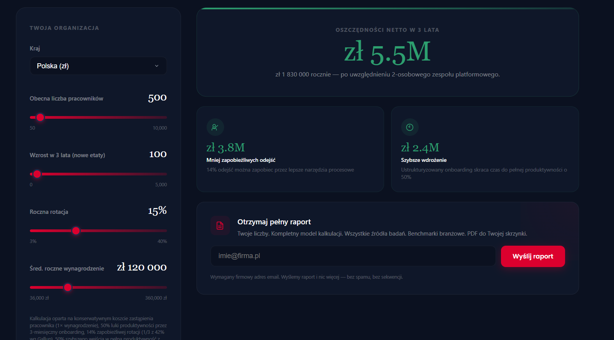

<h1 align="center">Angelika Kędzierska</h1>
<h3 align="center">CRM & Email Marketing Specialist · Salesforce Certified · Webmaster @ WEBCON</h3>

<br/>

## 🇬🇧 English

I'm a Salesforce-certified email marketing specialist with 4 years of hands-on production experience, currently working as a Webmaster at WEBCON — a Polish low-code BPM platform company.

My background is in **high-volume, data-driven email campaigns**: I spent four years at a digital agency building responsive HTML/CSS templates, writing AMPscript personalization logic, setting up lifecycle and triggered email flows, and optimizing deliverability across 50+ email clients. I also mentored junior team members on email development best practices.

Now at WEBCON, I've shifted toward the web side: WordPress development with Gutenberg, SEO, landing pages, and analytics (GA4, Microsoft Clarity, Google Search Console). It's given me a much broader view of how marketing actually connects — from campaign execution to the website experience and conversion.

---

### 🔧 What I work with

**Email & CRM:** Salesforce Marketing Cloud · AMPscript · Mailchimp · Lifecycle & triggered flows · A/B testing · Litmus / Email on Acid · GDPR compliance

**Web & Analytics:** WordPress · Gutenberg · SEO · GA4 · Microsoft Clarity · GTM · Google Search Console

**Automation & No-code:** Make.com · Zapier · HTML/CSS/JS

---

### 🚧 Currently building — HR ROI Calculator (side project, ~1 month to launch)

I'm working on an end-to-end automation that powers an HR ROI Calculator. The idea: a user enters their organization's data (number of employees, annual turnover rate, average salary), and within minutes receives a personalized PDF report in their inbox — calculated, generated and delivered automatically, with no manual work.

The pipeline I'm building and testing:

```
Webhook (form submit) → Python script (calculations + HTML generation) → PDF.co (HTML→PDF) → Email delivery
```



It's been a great exercise in thinking beyond the happy path — handling edge cases, validating inputs, making sure the email actually lands. Should be production-ready in about a month.

*Stack: Zapier · Webhooks · Python · PDF.co · Email by Zapier*

---

### 🎯 What I'm focused on next

- Attribution and conversion analysis — going beyond opens and clicks
- More complex, multi-step automation workflows with proper error handling
- SMS and push as new channels to complement email flows

---

📌 **Portfolio:** [angelikakedzierska.pl(https://angelikakedzierska.pl)  
📌 **LinkedIn:** [/in/angelika-kędzierska](https://www.linkedin.com/in/angelika-k%C4%99dzierska-61475a21b/)

---

## 🇵🇱 Polski

Jestem certyfikowaną specjalistką Salesforce Marketing Cloud z 4-letnim doświadczeniem produkcyjnym, obecnie pracującą jako Webmaster w WEBCON — polskiej firmie tworzącej platformę low-code BPM.

Moje tło to **masowe, oparte na danych kampanie e-mailowe**: przez cztery lata w agencji cyfrowej budowałam responsywne szablony HTML/CSS, pisałam logikę personalizacji w AMPscript, konfigurowałam przepływy lifecycle i triggered, optymalizowałam dostarczalność na ponad 50 klientach pocztowych. Mentorowałam też młodszych członków zespołu.

W WEBCON skupiłam się na stronie webowej: WordPress z Gutenbergiem, SEO, landing pages i analityka (GA4, Microsoft Clarity, Google Search Console). To dało mi szerszy obraz tego, jak marketing naprawdę się łączy — od egzekucji kampanii przez doświadczenie na stronie po konwersję.

---

### 🔧 Z czym pracuję

**Email i CRM:** Salesforce Marketing Cloud · AMPscript · Mailchimp · Przepływy lifecycle i triggered · Testy A/B · Litmus / Email on Acid · Zgodność z RODO

**Web i analityka:** WordPress · Gutenberg · SEO · GA4 · Microsoft Clarity · GTM · Google Search Console

**Automatyzacja i no-code:** Make.com · Zapier · HTML/CSS/JS

---

### 🚧 Aktualnie buduję — Kalkulator HR ROI (projekt własny, ~miesiąc do launchu)

Pracuję nad kompleksową automatyzacją obsługującą kalkulator HR ROI. Idea: użytkownik wpisuje dane swojej organizacji (liczba pracowników, rotacja, wynagrodzenie), a w kilka minut dostaje spersonalizowany raport PDF na skrzynkę — wyliczony, wygenerowany i dostarczony automatycznie, bez żadnej ręcznej pracy.

Pipeline, który buduję i testuję:

```
Webhook (submit formularza) → skrypt Python (obliczenia + generowanie HTML) → PDF.co (HTML→PDF) → wysyłka emaila
```


To dobra lekcja myślenia poza happy path — obsługa edge case'ów, walidacja danych, upewnienie się, że email faktycznie trafia do skrzynki. Powinno być gotowe do produkcji za mniej więcej miesiąc.

*Stack: Zapier · Webhooks · Python · PDF.co · Email by Zapier*

---

### 🎯 Na czym skupiam się dalej

- Analiza atrybucji i konwersji — poza otwarciem i kliknięciem
- Złożone, wieloetapowe przepływy automatyzacji z obsługą błędów
- SMS i push jako nowe kanały uzupełniające email

---

📌 **Portfolio:** [angelikakedzierska.pl](https://angelikakedzierska.pl)  
📌 **LinkedIn:** [/in/angelika-kędzierska](https://www.linkedin.com/in/angelika-k%C4%99dzierska-61475a21b/)

---

<p align="center">
  
  
  
  
  
  
  
</p>
